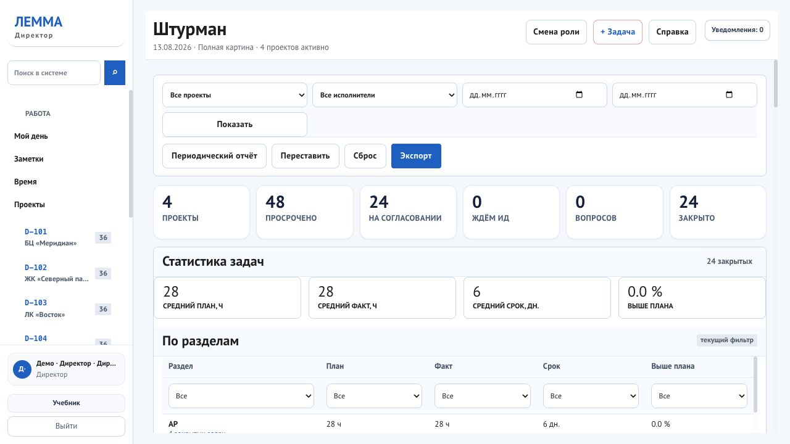
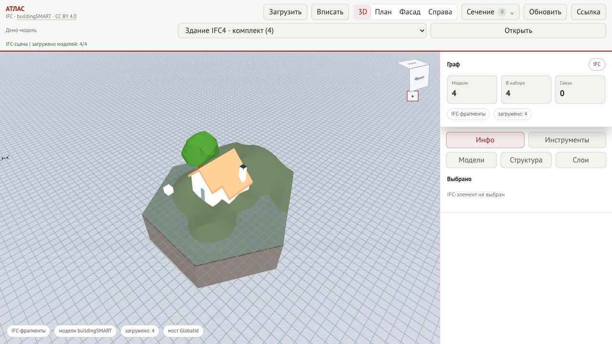
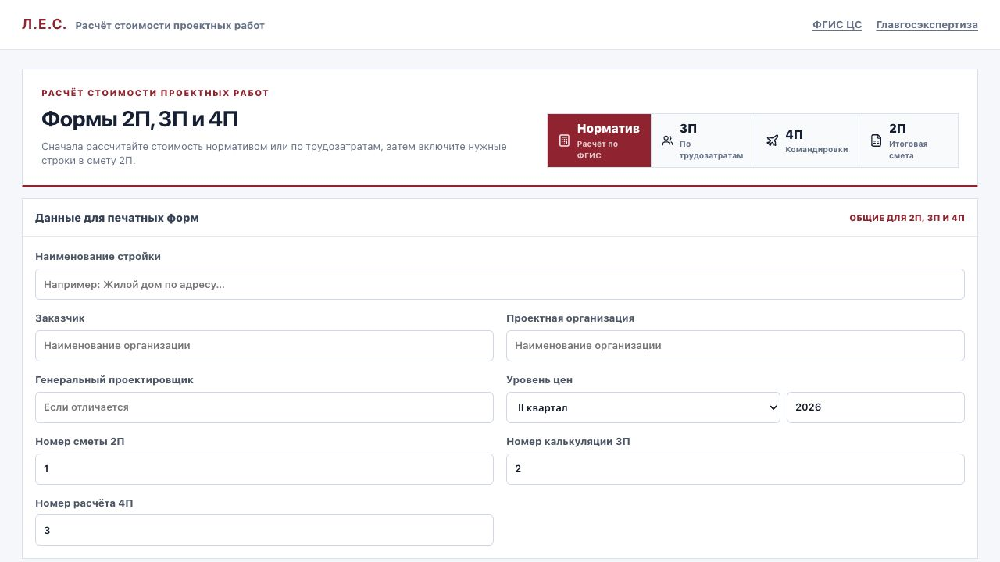
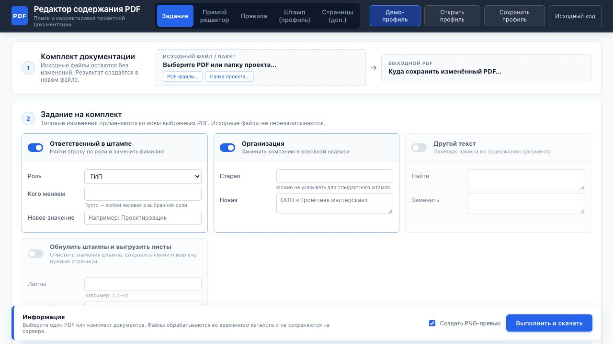

# Locia

[](https://github.com/proovcme/locia/actions/workflows/selfhost-smoke.yml)
[](https://locia.work/)
[](docs/SELF_HOSTING.md)

**Locia — открытая витрина и self-hosted набор инструментов для проектной организации.** Он объединяет управление проектами в проектировании, работу с IFC-моделями, расчёт стоимости и корректировку PDF-документации.

[Открыть locia.work](https://locia.work/) · [Лемма](https://locia.work/lemma/) · [Атлас](https://locia.work/atlas/) · [Калькулятор](https://locia.work/pircalc/) · [PDF-редактор](https://locia.work/pdf-editor/) · [FITOUT](https://locia.work/game/)


## Продукты

### Лемма — управление проектами в проектировании

«Лемма» собирает проект, команду и ежедневную работу в одном контуре. Это не универсальный таск-трекер, а система для проектной организации со стадиями, разделами, ответственными и проверяющими.

- проекты, этапы и разделы проектной документации;
- задачи с исполнителем, проверяющим, сроком, результатом и возвратом на доработку;
- рабочее пространство «Мой день» и контроль просроченных задач;
- план-факт времени, загрузка команды и проектные показатели;
- роли, подразделения, отчёты и управленческие представления;
- связь проектной работы с информационными моделями и расчётами.

[Открыть демо «Леммы»](https://locia.work/lemma/)



### Атлас — просмотр информационных моделей

«Атлас» — браузерный IFC viewer для просмотра и проверки BIM/ТИМ-моделей без установки настольного ПО.

- загрузка локальных IFC-файлов и одновременная работа с несколькими моделями;
- дерево пространственной структуры и свойства выбранных элементов;
- управление видимостью моделей и слоёв;
- измерение расстояний и построение сечений по трём осям;
- обработка IFC в браузере через WebAssembly и отображение в WebGL;
- каталог из 23 открытых моделей [buildingSMART Sample & Test Files](https://github.com/buildingSMART/Sample-Test-Files).

[Открыть «Атлас»](https://locia.work/atlas/)



### Калькулятор — стоимость проектных работ

Публичный сметный калькулятор помогает собрать расчёт стоимости проектных и изыскательских работ и показывает, из чего получился итог.

- расчёт по нормативным данным ФГИС ЦС;
- сводная форма 2П;
- расчёт по трудозатратам в форме 3П;
- командировочные расходы в форме 4П;
- формулы, ссылки на источник, предупреждения и блокирующие проверки;
- сохранение данных в браузере и экспорт результата в XLSX.

[Открыть «Калькулятор»](https://locia.work/pircalc/)



### PDF-редактор — корректировка проектной документации

Web-версия редактора из [`proovcme/pir_utilitys#2`](https://github.com/proovcme/pir_utilitys/pull/2) выполняет пакетные операции над копиями PDF и показывает совпадения до обработки.

- поиск, замена и удаление текста;
- профиль основных надписей СПДС;
- прямой выбор текстового блока на странице;
- удаление, поворот, дублирование, извлечение и вставка страниц;
- пакетная обработка нескольких PDF с продолжением после ошибки отдельного файла;
- скачивание результата и предварительный просмотр страниц.

[Открыть «PDF-редактор»](https://locia.work/pdf-editor/)



## Как продукты работают вместе

| Контур | Что в нём происходит |
|---|---|
| **Лемма** | Организует проект: этапы, разделы, команду, задачи, сроки и контроль результата |
| **Атлас** | Даёт проектной команде открыть IFC, изучить состав модели, свойства и геометрию |
| **Калькулятор** | Формирует обоснованный расчёт стоимости проектных работ и выгрузку для дальнейшей работы |
| **PDF-редактор** | Корректирует тексты, штампы и состав листов перед выпуском документации |

Публичные версии доступны как самостоятельные приложения на отдельных URL. При self-hosted развёртывании весь набор работает под одним доменом.

## Технологический стек

| Часть | Технологии | Назначение |
|---|---|---|
| **Лемма** | PHP 8.4, PDO, server-rendered HTML, JavaScript, CSS | Серверное приложение управления проектами без обязательного frontend-фреймворка |
| **Данные** | MariaDB 11.4 в рабочем контуре, SQLite в демо | Постоянная рабочая база или изолированная демонстрационная база |
| **Атлас** | TypeScript, Vite, Three.js, That Open Components, web-ifc, WebAssembly | Разбор IFC и интерактивная 3D-сцена в браузере |
| **Калькулятор** | React 18, TypeScript, Vite, ExcelJS, IndexedDB | Клиентский расчёт, локальное сохранение и экспорт XLSX |
| **PDF-редактор** | JavaScript, Vite, Python 3.12, PyMuPDF, FastAPI | Анализ и пакетная обработка PDF во временном изолированном контейнере |
| **Web и HTTPS** | Caddy 2.10 | Раздача приложений, маршрутизация и автоматический TLS |
| **Поставка** | Docker Compose, GitHub Actions | Воспроизводимый self-hosted запуск и smoke-проверки обоих режимов |

В репозитории находятся исходники «Леммы», готовые браузерные сборки «Атласа» и «Калькулятора», конфигурация контейнеров и документация для самостоятельного размещения.

## Быстрый запуск демо

```bash
git clone https://github.com/proovcme/locia.git
cd locia
docker compose up --build -d
```

Откройте [http://localhost:8080](http://localhost:8080). Демо использует синтетические данные и пересоздаётся при старте.

## Развёртывание для работы

Рабочий контур использует постоянную MariaDB, обычный вход по паролю и автоматические миграции.

```bash
./scripts/init-work.sh admin@company.ru
docker compose --env-file .env.work -f compose.work.yml up --build -d
./scripts/backup-work.sh
```

После первой команды сохраните показанный пароль администратора. Локальный адрес — [http://localhost:8080](http://localhost:8080). Настройка сервера с доменом и HTTPS, обновление и восстановление из резервной копии описаны в [инструкции по self-hosting](docs/SELF_HOSTING.md).

Рабочая установка автономна: она не подключается к служебным контурам `locia.work`, а интеграции обновлений, уведомлений и Revit по умолчанию выключены.

## Состав репозитория

```text
apps/lemma/       PHP-приложение и миграции MariaDB
public/atlas/     браузерный IFC viewer и каталог моделей
public/pircalc/   сметный калькулятор
apps/pdf-editor/  web-интерфейс и изолированный PDF-движок
site/             публичная витрина
docker/           контейнеры и Caddy
scripts/          аудит, настройка и резервное копирование
```

Архитектура и границы публикации описаны в [docs/ARCHITECTURE.md](docs/ARCHITECTURE.md) и [docs/PUBLIC_BOUNDARY.md](docs/PUBLIC_BOUNDARY.md). О проблемах безопасности: [hello@locia.work](mailto:hello@locia.work).

## Лицензии

Внутреннее использование и изменение Locia в собственной организации разрешены условиями [LICENSE.md](LICENSE.md). PDF-редактор выделен в самостоятельный компонент под [GNU AGPL v3 или более поздней версией](apps/pdf-editor/COPYING), поскольку использует PyMuPDF. Модели buildingSMART распространяются по CC BY 4.0; атрибуция приведена в [THIRD_PARTY_NOTICES.md](THIRD_PARTY_NOTICES.md).
